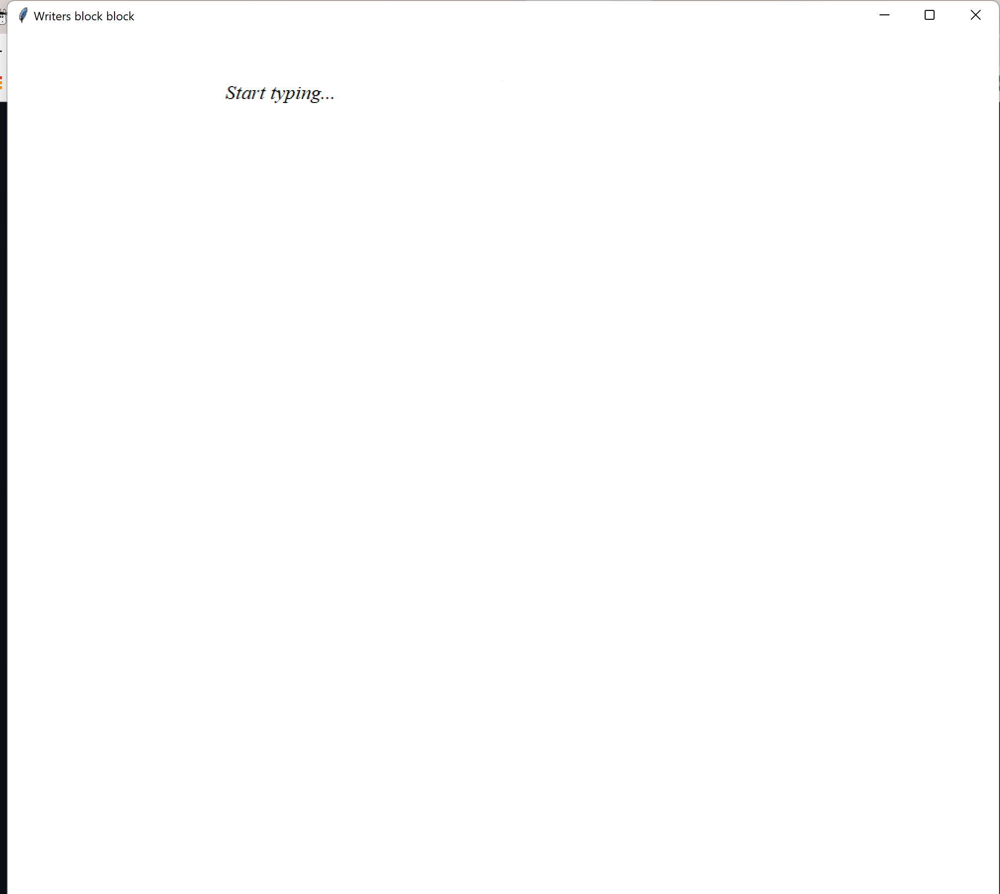

# Most Dangerous Writing App

## Demo

Install the repository and dependencies and run the application. You will need python installed, I used pycharm as the
IDE but any should do. The application runs on Tkinter

## Table of Contents

- [Description](#description)
- [Installation](#installation)
- [Usage](#usage)
- [Contributors](#contributors)
- [Test](#test)
- [Credits](#credits)
- [License](#license)
- [Questions](#questions)

## Description:

Writers block is a huge issue and this project makes writing a pretty intense experience. You can use this as a way to
get out of writers block and if you write something you want to keep just copy and paste all.

## Installation:

Using tkinter for the user interface, I set up the screen and styled appropriately. A timer begins and every time a key
is pressed the timer is reset to 5. If this timer gets to 1 the text goes red and if the timer gets to 0. It resets the
text to empty

## Usage:

The purpose of this project is to develop my python skills and also give an opportunity to prevent writers block

***
  
The image above shows the game in progress with the amazing GUI

***

## Contributors:

[Ben Cyna](https://github.com/bencyna/)

## Test:

Install the repository and hit run. Oh and import the dependencies

## License:

      For additional information about the License, click the link below.

- [License](https://opensource.org/licenses/MIT)

## Questions:

      If you have any questions about the Calendule project, you can follow the link below to navigate to my GitHub page:

- [GitHub Profile](https://github.com/bencyna)

For further information on this project, if you'd like to discuss changes or work together - please reach out directly
to: https://www.linkedin.com/in/bencyna567/.